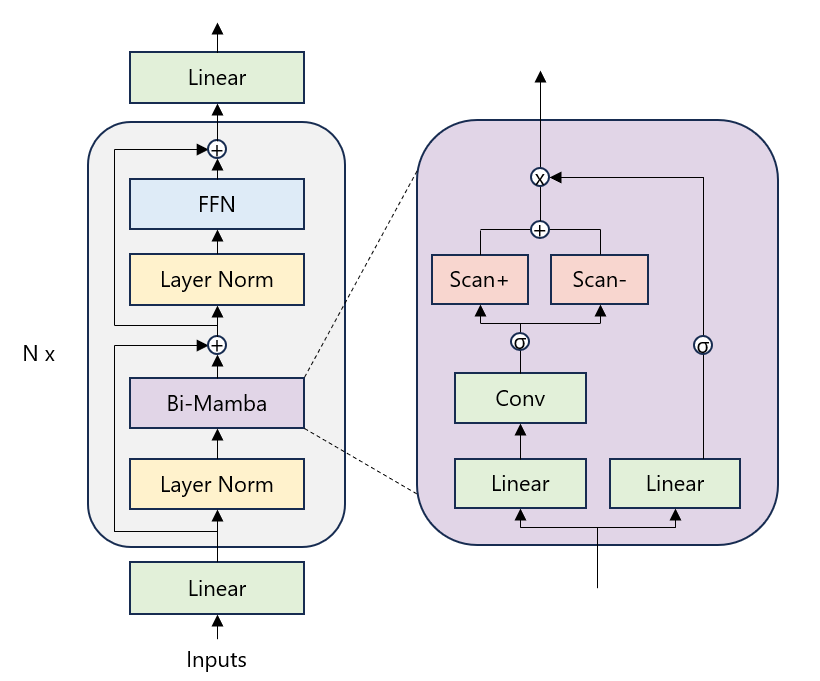
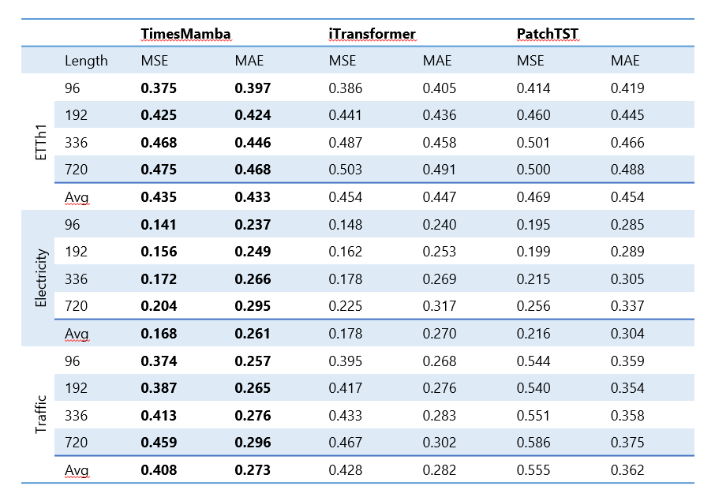

# Mamba for Multivariate Time Series Forecasting

The repo implements a Mamba-empowered model for multivariate time series forecasting - TimesMamba.

<!-- ## Updates -->

## Introduction

🌟 We implement a Mamba-based model for multi-variate time series forecasting. We use series embedding and let Mamba learn the correlations among the series.

🌟 Without attention, Mamba achieves the same modeling power as Transformer while consuming much less VRAM.

🌟 We conduct experiments demonstrating that Mamba performs better on multiple long-term time series forecasting benchmarks.

## Overall Architecture

TimesMamba consists of the following components:

- A reversible instance normalization layer to normalize individual series.
- A linear embedding layer that projects individual series into the embedding space.
- Mamba blocks that capture the correlations among the series.

A Mamba block contains two major components: a bidirectional Mamba and a FFN. The Mamba module replaces the self-attention layer in a typical Transformer encoder. `Scan+` and `Scan-` in the diagram indicate the normal and reverse order scanning.



We regard the series embedding as a special case of patching where the patch length equals the series length. We consider both channel-mixing and channel-independent modes.

## Datasets

The datasets can be obtained by following the instructions in this [repo](https://github.com/thuml/iTransformer).

## Usage

### Environment setup

1. Install miniconda.

2. Create a conda environment and install Pytorch and necessary dependencies. The environment is named as `timesmamba`. You may run the following bash script.

```bash
bash create_env.sh
```

### Model training and evaluation

Train and evaluate the model. We provide the scrips under the folder ./scripts/. You can reproduce the results as the following examples:

```bash
# Multivariate forecasting with TimesMamba
bash run.sh

# Tuning parameters
bash run_tuning.sh
```

## Main Result of Multivariate Forecasting

We evaluate the TimesMamba on ETTh1, Electricity (ECL), and Traffic. These three datasets have diverse characteristics. 

We set the lookback window to 96. We use channel independence for ETTh1 and channel mixing for others. We train the model for ten epochs and select the model having the best validation loss within these ten epochs. 

The main results are shown in the following table. The results of iTransformer and PatchTST are extracted from the iTransformer paper.



## Findings

### What role does Mamba play?

We find that Mamba is a good substitute for the attention module in Transformer. It is also more effective at capturing long-term dependencies while enjoying linear growth in terms of computation and VRAM cost. You may turn off the Mamba module by supplying `--ssm_expand 0`.

### What role does FFN play?

We conduct experiments using ensemble of Mamba modules without FFN and the single Mamba module with FFN. Experiments show that the FFN layer functions similar as ensembling multiple Mamba modules while pocessing much less VRAM. You may turn off the FFN layer by supplying `--r_ff 0`.

### Channel independence vs Channel mixing

We find that channel independence may be more effective for series having low variate correlation, while channel mixing may be more effective for the opposite case. This finding is consistent with the paper [TFB](https://arxiv.org/abs/2403.20150). However, the Mamba module is ineffective in channel-independent mode since the sequence length is only one, and the Mamba module cannot capture any long-term dependencies. You may use the channel independence mode by supplying `--channel_independence`.

### Reversible instance normalization

[RevIN](https://github.com/ts-kim/RevIN) focuses on solving the distribution shift problem. We find this trick works well for most datasets. Learnable affine transformation may boost the performance further for some datasets. However, RevIN does not work well for the (subset of) PEMS dataset. You may turn off RevIN using `--no_norm`. You may turn on learnable affine transformation using `--revin_affine`.

### Effective of temporal features

The temporal features are timestamps that indicate the month of year, day of week, hour of day, etc. We append these features to the series as additional variables and find that they are especially effective for the Traffic dataset. However, they may harm the performance of some datasets. We find that series with high seasonality benefit from such features. You may turn these features on using `--use_mark`.

<!-- ## Citation -->

## Acknowledgement

We greatly appreciate the following GitHub repos for their valuable code and efforts.

- RevIN (https://github.com/ts-kim/RevIN)
- iTransformer (<https://github.com/thuml/iTransformer>)
- Mamba (<https://github.com/state-spaces/mamba>)
- VMamba (<https://github.com/MzeroMiko/VMamba>)

I also want to thank Qianxiong Xu, Chenxi Liu, Ziyue Li and Cheng Long for their valuable advice.

## Contact

If you have any questions or want to use the code, feel free to contact: [shaowen.zhou@ntu.edu.sg](mailto:shaowen.zhou@ntu.edu.sg)
